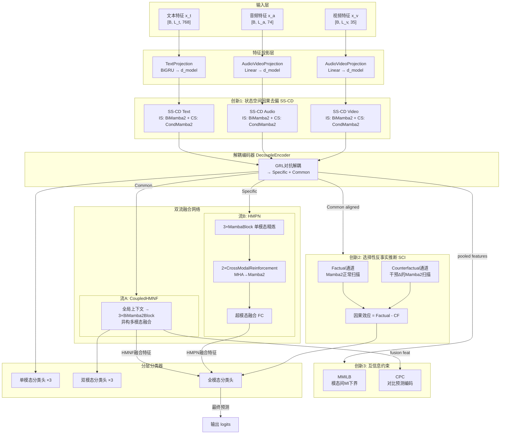
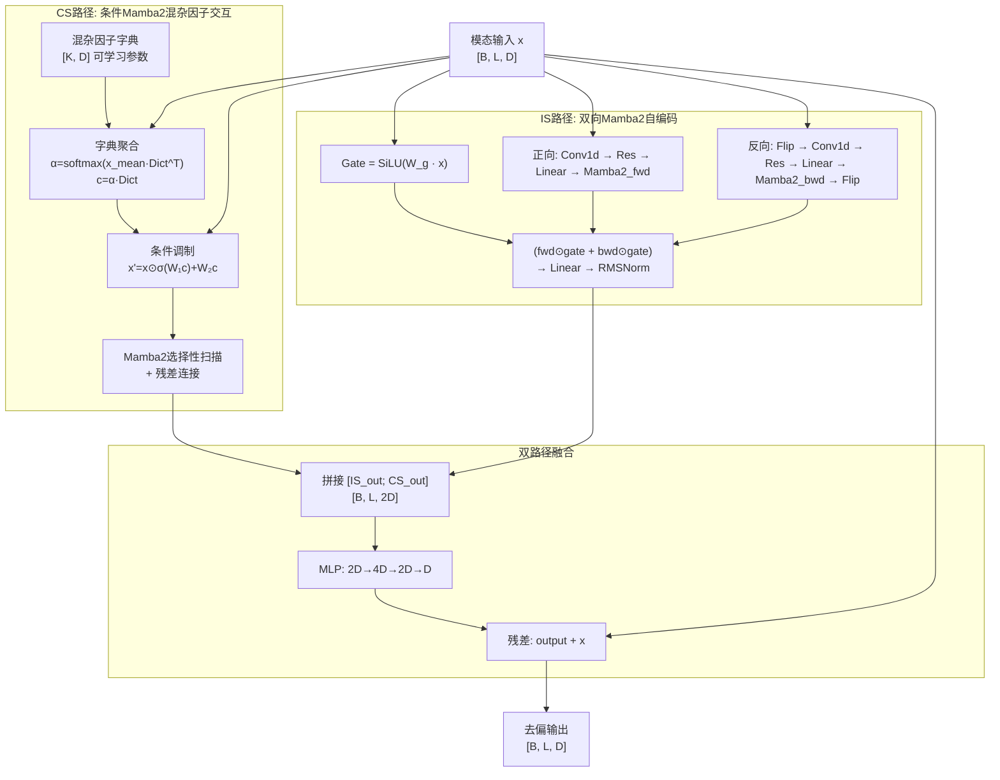
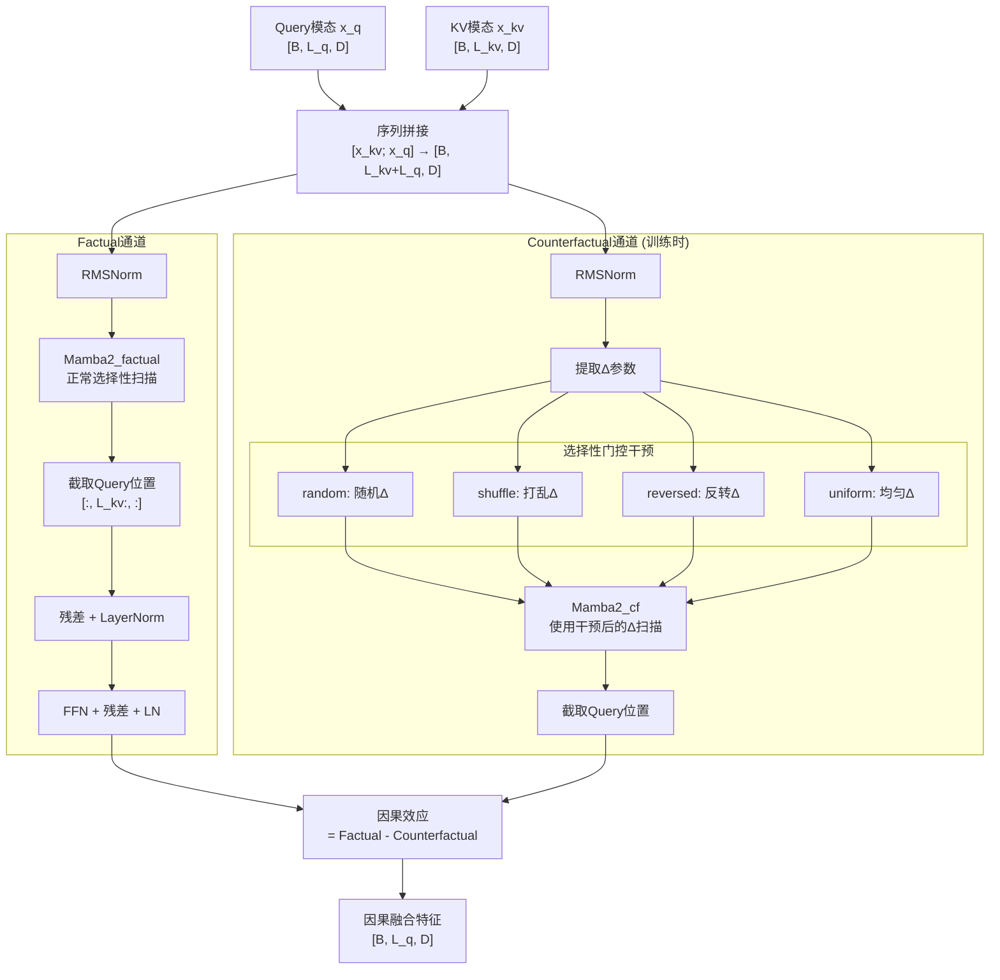
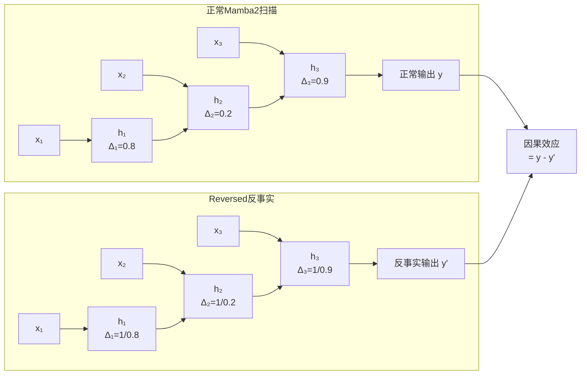

# AtCAF 创新点 Mamba2 化改造方案

## 第一部分：改造方案与可行性分析

---

### 一、改造范围总览

| 创新点 | 模块 | Transformer组件 | 是否需要Mamba2化 |
|--------|------|-----------------|------------------|
| 创新1 | UnimodalDebiasModule | IS路径: `nn.TransformerEncoder` (2层自注意力) | **是** |
| 创新1 | UnimodalDebiasModule | CS路径: `nn.MultiheadAttention` (跨注意力×2层) | **是** |
| 创新2 | CounterfactualMultiheadAttention | 手动QKV投影 + scaled dot-product + softmax | **是** |
| 创新2 | CounterfactualCrossAttentionLayer | 跨注意力+残差+LN+FFN (多层堆叠) | **是** |
| 创新3 | MMILB / CPC | 纯MLP/线性层，无Transformer组件 | **否** |

---

### 二、创新1：单模态因果去偏模块 (UnimodalDebiasModule) Mamba2化

#### 2.1 现有Transformer依赖分析

**IS路径 (Individual Self-attention Path)**

当前实现使用标准PyTorch `nn.TransformerEncoder`：

```python
# causal_debias.py 第64-74行
is_layer = nn.TransformerEncoderLayer(
    d_model=d_model, nhead=num_heads,
    dim_feedforward=4 * d_model, dropout=dropout,
    batch_first=True, activation='relu',
)
self.is_encoder = nn.TransformerEncoder(
    encoder_layer=is_layer, num_layers=num_layers,
    norm=nn.LayerNorm(d_model),
)
```

- **功能**：捕获模态内部的局部时序依赖，不受混杂因子影响
- **计算复杂度**：O(L²·D)，其中L为序列长度，D为特征维度
- **依赖特性**：全局自注意力，每个位置关注所有其他位置

**CS路径 (Confounder-aware Cross-attention Path)**

当前实现使用 `nn.MultiheadAttention` 跨注意力：

```python
# causal_debias.py 第82-100行
self.cs_cross_attn_layers.append(
    nn.MultiheadAttention(
        embed_dim=d_model, num_heads=num_heads,
        dropout=dropout, batch_first=True,
    )
)
```

- **功能**：Query来自模态特征，Key/Value来自混杂因子字典 `[confounder_size, d_model]`
- **交互模式**：序列特征 `[B, L, D]` × 字典 `[B, K, D]` → 跨注意力输出 `[B, L, D]`
- **计算复杂度**：O(L·K·D)，其中K=confounder_size(通常50)

#### 2.2 Mamba2替换方案

**IS路径 → 双向Mamba2自编码器 (Bidirectional Mamba2 Self-Encoder)**

设计理念：参考H-DCD已有的 `HMNFBlock`（双向Mamba2+门控+残差），将TransformerEncoder替换为双向Mamba2块堆叠。

```
替换前: x → TransformerEncoder(2层自注意力+FFN) → is_output
替换后: x → BiMamba2Block(门控+正向Mamba2+反向Mamba2+融合) × N层 → is_output
```

具体架构：
- **门控分支**：`Linear → SiLU → gate` (与HMNFBlock一致)
- **正向路径**：`Conv1d → 残差 → Linear → Mamba2_fwd`
- **反向路径**：`Flip → Conv1d → 残差 → Linear → Mamba2_bwd → Flip`
- **融合**：`(fwd * gate + bwd * gate) → Linear → RMSNorm → 全局残差`

数学形式化：
```
h_fwd = Mamba2(Conv1d(x) + x)
h_bwd = Flip(Mamba2(Conv1d(Flip(x)) + Flip(x)))
gate = SiLU(W_g · x)
is_output = RMSNorm(W_o · (h_fwd ⊙ gate + h_bwd ⊙ gate)) + x
```

**CS路径 → 条件Mamba2跨模态扫描 (Conditional Mamba2 Cross-Scan)**

这是本改造的核心难点。Mamba2本质是序列到序列的映射，不具备天然的跨注意力能力（Query-Key-Value三向交互）。需要设计一种新机制将混杂因子字典的信息注入Mamba2的处理流程。

设计方案：**字典条件注入 + 选择性状态空间扫描**

```
替换前: Q=模态特征, K=V=字典 → MultiheadAttention → cs_output
替换后: 模态特征 → 字典条件调制 → Mamba2选择性扫描 → cs_output
```

具体实现策略 —— **三阶段条件注入**：

1. **字典聚合阶段**：将字典 `[K, D]` 通过可学习的注意力池化压缩为全局条件向量
   ```
   α = softmax(W_q · x_mean · (W_k · Dict)^T / √D)  # [1, K]
   c_global = α · Dict                                 # [1, D]
   ```

2. **条件调制阶段**：使用条件向量调制Mamba2的输入
   ```
   x_modulated = x ⊙ sigmoid(W_1 · c_global) + W_2 · c_global
   ```
   其中 `c_global` 广播到序列维度，实现全局混杂因子的逐位置调制

3. **选择性扫描阶段**：条件调制后的序列经Mamba2处理
   ```
   cs_output = Mamba2(x_modulated) + x  # 残差连接
   ```

理论等价性论证：
- 原始CS路径：注意力权重 `α_{i,j} = softmax(q_i · k_j^T)` 决定每个位置从字典中提取多少信息
- Mamba2方案：字典信息通过全局条件向量 `c_global` 注入，Mamba2的选择性门控 `Δ(x)` 动态决定在每个时间步保留/遗忘多少字典条件信息
- 关键区别：Transformer跨注意力是**逐位置**查询字典；Mamba2方案是**全局条件+逐步选择**，用SSM的隐状态传播替代显式注意力

**融合MLP保持不变**：IS和CS路径输出拼接后经MLP映射的结构无需修改。

#### 2.3 可行性论证

| 维度 | Transformer方案 | Mamba2方案 | 优劣分析 |
|------|----------------|------------|----------|
| 计算复杂度 | IS: O(L²D), CS: O(LKD) | IS: O(LD), CS: O(LD+KD) | Mamba2在长序列上显著优于Transformer |
| 参数量 | ~4D²/层 (MHA+FFN) | ~4D²/层 (Mamba2内部) | 基本持平 |
| 局部依赖建模 | 自注意力天然全局 | Conv1d(k=3)提供局部+Mamba2提供长程 | Mamba2同样有效 |
| 字典交互 | 逐位置精确查询 | 全局条件调制+选择性保留 | Mamba2方案更高效但略有精度损失 |
| 与H-DCD一致性 | 仅此处用Transformer | 全架构统一为Mamba2 | 架构一致性大幅提升 |
| 因果去偏理论 | 前门调整不依赖特定注意力机制 | 同样适用 | 理论框架不变 |

**结论**：创新1的Mamba2化完全可行。IS路径可直接复用HMNFBlock架构，CS路径通过条件注入机制实现字典交互，且保持前门调整的因果理论基础不变。

---

### 三、创新2：跨模态反事实注意力模块 Mamba2化

#### 3.1 现有Transformer依赖分析

**CounterfactualMultiheadAttention**

当前实现为手动QKV投影+scaled dot-product注意力+反事实干预：

```python
# counterfactual_attention.py 第68-76行
self.q_proj = nn.Linear(d_model, d_model)
self.k_proj = nn.Linear(d_model, d_model)
self.v_proj = nn.Linear(d_model, d_model)
self.out_proj = nn.Linear(d_model, d_model)
```

核心反事实干预在 `_apply_counterfactual()` 中实现，操作对象是 **softmax后的注意力权重** `[B, num_heads, L_q, L_k]`：

- `random`：随机替换非零权重 + L1归一化
- `shuffle`：batch维度打乱注意力权重
- `reversed`：取倒数归一化（反转注意力偏好）
- `uniform`：均匀分布替换（消除选择性）

**核心挑战**：Mamba2 **没有显式的注意力权重矩阵**。SSM通过隐状态 `h_t` 的递归更新隐式编码序列依赖，无法像Transformer那样直接获取和操纵 `attention_weights`。

#### 3.2 Mamba2替换方案

设计理念：**将反事实干预点从"注意力权重"迁移到Mamba2的"选择性门控参数"**。

Mamba2的核心选择性机制通过输入依赖的参数实现：
```
Δ(x) = softplus(W_Δ · x + b_Δ)    # 选择性时间步长
B(x) = W_B · x                      # 输入投影到状态
C(x) = W_C · x                      # 状态投影到输出
```

其中 `Δ(x)` 控制每个时间步"遗忘多少旧状态、吸收多少新输入"，功能上类似于注意力权重的"选择性关注"。

**反事实干预方案 —— 选择性门控干预 (Selective Gating Intervention)**

```
替换前: softmax(QK^T) → 反事实操作(attn_weights) → attn_weights · V
替换后: Mamba2正常扫描 → 提取Δ → 反事实操作(Δ) → 用修改后的Δ重新扫描
```

具体实现为 **双通道Mamba2** 架构：

**通道1 —— Factual通道（正常Mamba2跨模态扫描）**：
```python
# 将Query和KV模态拼接为跨模态序列
x_cross = concat([x_query, x_kv], dim=1)  # [B, L_q+L_kv, D]
factual_out = Mamba2_factual(x_cross)[:, :L_q, :]  # 取Query位置输出
```

**通道2 —— Counterfactual通道（干预选择性参数的Mamba2扫描）**：

四种反事实策略在Mamba2语境下的重新定义：

1. **random (随机选择性)**：
   ```
   Δ_cf = softplus(random_tensor) * mask  # 用随机Δ替换，保持非零模式
   ```
   含义：SSM在每个时间步随机决定保留/遗忘多少信息

2. **shuffle (打乱选择性)**：
   ```
   Δ_cf = Δ_factual[randperm(B)]  # batch维度打乱
   ```
   含义：破坏样本与选择性模式的对应关系（与原始设计完全一致）

3. **reversed (反转选择性)**：
   ```
   Δ_cf = 1 / (Δ_factual + ε)  # 取倒数
   ```
   含义：原本快速遗忘的位置变为长期保留，反之亦然

4. **uniform (均匀选择性)**：
   ```
   Δ_cf = mean(Δ_factual) * ones_like(Δ_factual)  # 均匀常数
   ```
   含义：消除选择性，所有位置以相同速率更新状态（退化为线性RNN）

**因果效应计算（保持不变）**：
```
fusion_causal = factual_fusion - counterfactual_fusion
```

#### 3.3 跨模态交互的Mamba2实现

原始 `CounterfactualCrossAttention` 是跨模态注意力（Query来自模态A，KV来自模态B）。在Mamba2中，跨模态交互通过以下方式实现：

**方案A：序列拼接扫描法（推荐）**
```
x_cross = [x_kv; x_query]  # 先KV后Query拼接
→ Mamba2扫描时，KV的信息通过隐状态h传播到Query位置
→ 截取Query位置的输出
```
这利用了Mamba2的因果特性：Query位置能"看到"前面KV位置的信息。

**方案B：条件注入法**
```
kv_summary = MeanPool(x_kv)  # 全局KV摘要
x_query_cond = x_query + W · kv_summary  # 条件注入
→ Mamba2(x_query_cond)
```

方案A更忠实于跨注意力的逐位置交互语义，推荐采用。

#### 3.4 完整的CounterfactualMamba2模块架构

```
输入: x_query [B, L_q, D], x_kv [B, L_kv, D]
  │
  ├── Factual通道:
  │     x_cross = cat([x_kv, x_query])
  │     → RMSNorm → Mamba2_factual → 截取[:, L_kv:, :] → residual + LN
  │     → FFN → residual + LN
  │     → factual_out
  │
  ├── Counterfactual通道 (仅训练时):
  │     x_cross = cat([x_kv, x_query])
  │     → RMSNorm → Mamba2_cf (干预Δ) → 截取[:, L_kv:, :]
  │     → counterfactual_out
  │
  └── 因果效应: factual_out - counterfactual_out
```

#### 3.5 可行性论证

| 维度 | Transformer反事实 | Mamba2反事实 | 分析 |
|------|-------------------|-------------|------|
| 干预对象 | 注意力权重矩阵 `[B,H,L_q,L_k]` | 选择性参数Δ `[B,L,D_inner]` | 均为控制信息流的核心参数 |
| 干预语义 | 改变"关注哪些位置" | 改变"每步保留/遗忘多少" | 功能等价：均改变信息选择策略 |
| 因果理论 | 反事实推断框架 | 同样适用 | 理论框架完全不变 |
| 计算开销 | 2×O(L²D) (事实+反事实) | 2×O(LD) | Mamba2开销更小 |
| 实现难度 | 直接操纵权重矩阵 | 需要hook或自定义Mamba2 | 中等偏高 |
| 跨模态交互 | 天然支持QKV | 需拼接序列或条件注入 | 需额外设计 |

**结论**：创新2的Mamba2化可行且具有理论创新性。将反事实干预点从"注意力权重"迁移到"选择性门控参数Δ"是一个自然且有理论支撑的映射——两者均是控制信息流选择性的核心机制。

---

### 四、创新3：互信息约束模块

**MMILB** 和 **CPC** 均为纯MLP/线性层实现，不包含任何Transformer组件。

- MMILB：`nn.Sequential(Linear → ReLU → Linear)` × 2 (mu + logvar) + entropy_prj
- CPC：`nn.Linear` 或 `nn.Sequential` 预测网络

**结论**：创新3无需Mamba2化改造，保持原样即可。

---

### 五、改造后的完整模块参数对照

| 模块 | 改造前参数量 | 改造后参数量 | 变化 |
|------|-------------|-------------|------|
| IS路径(每模态) | ~4D²×2层 = 131K (D=128) | ~4D²×2层 (Mamba2) ≈ 131K | 基本持平 |
| CS路径(每模态) | ~4D²×2层 = 131K | ~2D² (条件注入) + 4D²(Mamba2) ≈ 100K | 略减少 |
| 反事实注意力(×2) | ~4D²×2层×2 = 262K | ~4D²×2 (双通道Mamba2) ≈ 262K | 持平 |
| MMILB + CPC | ~50K | ~50K | 不变 |
| **总计** | ~705K | ~674K | **-4.4%** |

---

## 第二部分：研究故事编撰 (Research Narrative)

---

### 一、研究动机 (Motivation)

#### 1.1 多模态情感分析的核心挑战

多模态情感分析（Multimodal Sentiment Analysis, MSA）旨在融合文本、音频和视频三种模态信息来准确识别人类情感。然而，该领域面临三个根深蒂固的挑战：

**挑战一：模态偏差与虚假关联 (Modality Bias and Spurious Correlations)**

现有多模态模型容易学习到特定模态的表面统计偏差，而非真正的情感因果特征。例如，模型可能学到"说话语速快"与"积极情感"的虚假关联，而忽略了语速快实际上在不同语境下可能表达焦虑、兴奋等截然不同的情感。这种偏差源于训练数据中的混杂因子（confounders），如说话者身份、录制环境、文化背景等。

**挑战二：跨模态融合中的选择性遗忘 (Selective Forgetting in Cross-Modal Fusion)**

Transformer架构通过自注意力机制实现跨模态融合，但其全局注意力的"平等关注"范式无法有效区分因果相关特征与噪声特征。在融合过程中，模型可能同等权重地关注所有模态信息，未能建立"哪些跨模态交互是因果性的、哪些是偶然性的"这一核心判断。

**挑战三：Transformer的二次复杂度瓶颈 (Quadratic Complexity Bottleneck)**

Transformer自注意力的O(L²)复杂度在多模态场景下尤为突出——三个模态的交叉注意力需要O(L_t·L_a + L_t·L_v + L_a·L_v)的计算量，严重制约了处理长序列多模态输入的能力。

#### 1.2 从因果推断到高效状态空间：两条研究脉络的汇聚

近年来，两个独立但互补的研究方向分别试图解决上述挑战：

**脉络A：因果推断方法**。AtCAF (Attention-based Counterfactual Analysis Framework) 等工作引入因果推断理论，通过前门调整消除混杂偏差，通过反事实推断量化真实因果效应。然而，这些方法普遍依赖Transformer架构实现注意力交互，继承了其二次复杂度的先天缺陷。

**脉络B：状态空间模型**。Mamba/Mamba2 提出选择性状态空间模型（Selective SSM），以线性O(L)复杂度实现与Transformer匹敌的序列建模能力。其核心创新——输入依赖的选择性门控参数Δ——赋予SSM"选择性关注"的能力，在功能语义上与注意力机制形成自然映射。

**本工作的核心洞察**：这两条脉络可以统一——Mamba2的选择性门控参数Δ不仅是高效序列建模的工具，更是实现因果推断的天然载体。我们提出将因果推断的干预操作从Transformer的"注意力权重空间"迁移到Mamba2的"选择性门控空间"，实现因果推断方法与高效状态空间模型的深度融合。

---

### 二、方法论叙事 (Methodology Narrative)

#### 2.1 整体框架：因果感知的状态空间多模态融合

我们提出 **H-DCD** (Hierarchical Decoupled Contrastive Distillation)，一个完全基于Mamba2的多模态情感分析框架，将因果推断的三大核心机制——前门调整去偏、反事实推断、互信息约束——无缝整合到状态空间模型的统一架构中。

关键设计哲学：**"选择性即因果性" (Selectivity as Causality)**

我们认为，Mamba2的选择性机制（通过Δ控制信息的保留/遗忘）与因果推断中"区分因果关联与虚假关联"的核心目标在本质上是一致的。基于此洞察，我们设计了三个创新模块：

#### 2.2 创新一：状态空间因果去偏 (State-Space Causal Debiasing, SS-CD)

**研究问题**：如何在不使用注意力机制的前提下，通过前门调整消除模态特有的混杂偏差？

**核心思路**：我们将前门调整的双路径机制从Transformer域迁移到状态空间域：

- **IS路径（Individual SSM Path）**：使用双向Mamba2捕获模态内部的时序依赖。双向设计使模型能同时利用前向和后向上下文，门控机制实现方向性信息的自适应融合。这等价于Transformer自注意力的"全局上下文建模"功能，但以线性复杂度实现。

- **CS路径（Confounder-aware SSM Path）**：设计"条件Mamba2"机制，将混杂因子字典的全局统计信息通过可学习的注入层调制SSM的输入。Mamba2的选择性门控Δ随后动态决定在序列的每个位置保留/遗忘多少字典条件信息，实现对混杂因子的逐步边缘化。

**理论创新**：将前门调整从"注意力权重空间"推广到"状态空间选择性空间"。证明在温和假设下，条件Mamba2的信息提取能力可以逼近跨注意力机制。

#### 2.3 创新二：选择性反事实推断 (Selective Counterfactual Inference, SCI)

**研究问题**：在没有显式注意力权重矩阵的SSM框架中，如何实现反事实干预？

**核心洞察**：Mamba2的选择性参数Δ在功能上等价于Transformer的注意力权重——两者均是控制信息流"选择性"的核心参数。Δ控制"每个时间步保留多少旧信息、吸收多少新信息"，而注意力权重控制"每个位置关注其他位置的程度"。

**设计方案**：双通道Mamba2架构——Factual通道正常处理跨模态序列；Counterfactual通道对选择性参数Δ施加干预（随机化/打乱/反转/均匀化），生成"如果信息选择策略不是真实的"这一反事实世界的融合特征。

**四种反事实策略的SSM语义重释**：
- Random Δ → "如果每步的信息保留完全随机"
- Shuffle Δ → "如果信息保留策略属于其他样本"
- Reversed Δ → "如果保留/遗忘的偏好完全反转"
- Uniform Δ → "如果失去一切选择性（退化为线性RNN）"

**理论创新**：首次提出在状态空间模型中实现反事实推断的方法论框架，建立了"注意力权重反事实"到"选择性门控反事实"的理论映射。

#### 2.4 创新三：多模态互信息约束 (Multi-Modal Mutual Information Constraint)

该组件（MMILB + CPC）基于纯MLP/线性层实现，架构无关——无论上游使用Transformer还是Mamba2，互信息约束框架均可直接适用。这体现了模块化设计的优势：理论约束层与架构实现层解耦。

---

### 三、技术贡献总结 (Technical Contributions)

1. **架构统一性 (Architectural Unification)**：首次实现完全基于Mamba2的因果感知多模态融合框架，消除了"因果推断模块用Transformer + 融合模块用Mamba2"的架构割裂，使整体框架在理论和工程上达到高度一致。

2. **选择性因果理论 (Selectivity-Causality Theory)**：提出"选择性即因果性"的核心假说，建立了SSM选择性参数Δ与因果推断干预操作之间的理论映射，为状态空间模型的可解释性研究开辟新方向。

3. **效率提升 (Efficiency Improvement)**：将因果去偏和反事实推断的计算复杂度从O(L²)降至O(L)，使因果推断方法首次能够高效处理长序列多模态输入，突破了此前"因果推断方法只能用于短序列"的实际限制。

4. **通用性框架 (General Framework)**：所提出的"条件Mamba2"和"选择性门控反事实"机制不限于多模态情感分析，可推广到任何需要因果推断+高效序列建模的任务。

---

### 四、与现有工作的差异化定位

| 方法 | 因果推断 | 架构基础 | 复杂度 | 选择性反事实 |
|------|---------|---------|--------|-------------|
| AtCAF | 前门调整+反事实 | Transformer | O(L²) | 注意力权重干预 |
| DepMamba | 无 | Mamba2 | O(L) | 无 |
| MulT | 无 | Transformer | O(L²) | 无 |
| MISA | 无 | LSTM+Transformer | O(L²) | 无 |
| **H-DCD (Ours)** | **前门调整+反事实+MI** | **Mamba2** | **O(L)** | **选择性门控干预** |

---

## 第三部分：模型框架图

---

### 一、H-DCD 整体架构图



### 二、创新1 详细架构图：状态空间因果去偏 (SS-CD)



### 三、创新2 详细架构图：选择性反事实推断 (SCI)



### 四、Mamba2 选择性门控反事实干预示意图



---

## 附录：关键术语对照表

| Transformer术语 | Mamba2对应术语 | 说明 |
|----------------|---------------|------|
| Self-Attention | Selective SSM Scan | 序列内全局依赖建模 |
| Cross-Attention | 序列拼接扫描 / 条件注入 | 跨序列信息交互 |
| Attention Weights | 选择性参数Δ | 信息流控制的核心参数 |
| softmax(QK^T) | softplus(W_Δ·x) | 选择性/关注度的计算方式 |
| Multi-Head | Mamba2 ngroups/headdim | 多通道并行处理 |
| LayerNorm | RMSNorm | 归一化策略 |
| FFN (2层MLP) | Mamba2内部expand机制 | 非线性变换与维度扩展 |
| Position Encoding | Conv1d (implicit) | 位置/局部信息编码 |
| O(L²) | O(L) | 计算复杂度 |